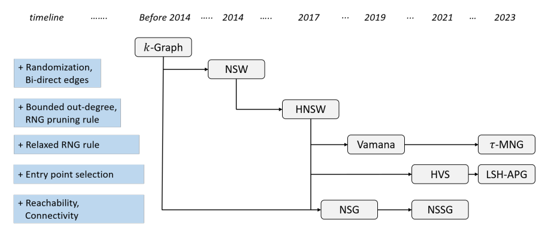
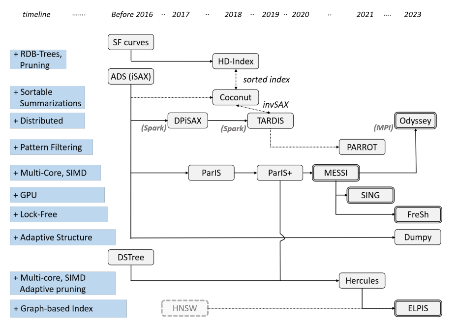
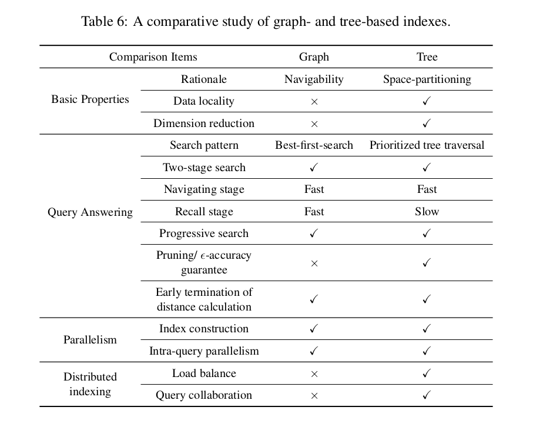

# Similarity search in high-dimensional spaces - a literature review
This document covers works that try to combine and reflect on the works of two communities in similarity search a) time series search and b) vector search.
For a more detailed overview of the works in these communities, see the respective literature reviews in[time_series](/timeseries_search/literature_review.md) and [vector_search](/vector_search/literature_review.md).

## Surveys
- [[Palpanas 23]](/papers/palpanas23_letter.pdf) - Letter from the Special Issue Editor - Special Issue on High-Dimensional Similarity Search: from Time Series Management Systems to Vector Databases.
    - Summary
        - There are two communities in similarity search: time series search and vector search. The two do not interact much.
        - The special issue aims to bring the two communities together.
        - There are many axes to the similarity search problem:
            - Exact and approximate search
            - Online, offline, and progressive search
            - Approximate algorithms with and without guarantees
            - On disk, in memory solutions
            - Static and streaming data
            - Single and multi-dimensional data
        - **Work on time-series showed to be SOTA** also on vector data problems.

- [[Wang 23]](/papers/wang23_survey.pdf) Graph- and Tree-based Indexes for High-dimensional Vector Similarity Search: Analyses, Comparisons, and Future Directions
    - ANN search on high-dimensional vectors
    - Summary
        - Compare graph-based algorithm (e.g., HNSW) with tree-based algorithm (e.g., kd-tree)
        - Tree-based algorithms pros and cons:
            - Pros: 
                - Index construction is fast
                - Interpretability
                - Enable accuracy guarantees and fast exact search
            - Cons:
                - Sucks on high-dimensional data
        - Graph-based algorithms overview (chronological order):
            - 
            1. **K-Graph:** k-nearest neighbor graph
            2. **NSW:** sequentially build (variant of) K-graph to reduce construction time
            3. **HNSW:** build a hierarchy of NSW graphs to speed up search
            4. **Vamana:** relax RNG pruning rule of HNSW to improve search quality
            5. **HVS:** use a secondary data structure to obtain better entry points
        - Tree-based algorithms overview:
            - 
            - Three families:
                1. **iSAX**
                    - Also see [Themis' survey](/timeseries_search/palpanas20_summary_gpt4o.md) for more details.
                    - iSAX, ADS, DpiSAX, TARDIS, PARROT, Coconut, ParIS, MESSI, SING, FreSh, Odyssey, Dumpy.
                2. **EAPCA**
                    - Also segment like iSAX but 1) segments are adaptive, and 2) representations based on both mean and std.
                    - DSTree, Hercules, ELPIS
                3. **Ordered-index**
                    - Sorts the data based on space-filling curves (e.g., Hilbert curve).
                    - SF curves, HD-index
            - Categorization based on contribution:
                1. Optimized for on-disk search
                    - **HD-Index:** builds multiple B+ trees to mitigate the loss of accuracy due to the curse of dimensionality.
                    - **Coconut:** compresses using SAX, then sorts SAX words by significance through z-order curve.
                    - **Dumpy:** designed for ANN search, dynamically sets number of segments to improve leave compactness.
                2. Parallel processing
                    - **ParIS:** parallelized ADS+
                    - **MESSI:** further optimizes ParIS for in-memory datasets
                    - **SING:** extends MESSI with GPUs
                    - **Hercules:** EAPCA-based parallelized disk search. Parallelizes CPU tasks with IO tasks.
                    - **FreSh:** iSAX-based in-memory index with novel lock-free approach for indexing and querying.
                3. Distributed processing
                    - **DPiSAX:** partitions data by the distribution on the SAX space.
                    - **TARDIS:** iSAX-based distributed index that clusters similar tree-nodes together.
                    - **PARROT:** extends TARDIS with a novel partitioning strategy.
                    - **Odyssey:** in-memory search on a distributed system with multiple cores (so distributed + parallel). Uses novel load balancing strategy.
        - Comparsion
            - 
            - **Graph-based algorithms don't explicitly handle the dimensionality** of the data; edges are created solely on the absolute distance between points, and therefore also suffer less from the curse of dimensionality.
            - Where tree-based algorithms can enjoy cache acceleration d.t. **data locality** (i.e., data of the same branch are close to each other in memory), graph-based algorithms cannot, as the data is not stored inside the graph.