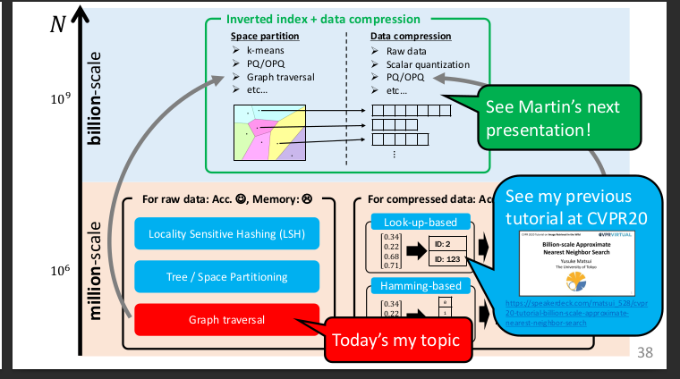

# Matsui 2023 - Theory and Applications of Graph-based Search - Tutorial @ CVPR 2023
- Lecture on graph-based similarity search algorithms like HNSW, NMSLIB, etc.
- Part of a tutorial on neural search at CVPR 2023.
- By Yusuke Matsui, University of Tokyo.
- Full video can be found [here](https://www.youtube.com/watch?v=tvoP1IyZRxE)
- Slides are found [here](/neural_search/graphbased_lecture/matsui23_tutorial_slides-graphbased_lecture.pdf)

## Summary
1. Problem
    - Graph-based algorithms solve Approximate Nearest Neighbor (ANN) search problems.
    - Generally using Euclidean distance and negative dot product similarity.
    - The algorithms are **heuristic solutions** -- they have no theoretical guarantees on the completeness of the results.
2. Levels of technology
    - Algorithms (e.g., HNSW)
    - Libraries (e.g., FAISS, NMSLIB)
    - Services (e.g., vector DBs like Pinecone)
    - 
    - 
3. Algorithms
    - Old algorithms on the million-scale used either an index or compression followed by exhaustive search.
    - New algorithms combine the two approaches.
    - **Graph-based algorithm are current SOTA**.
    
4. Graph-based algorithms
    1. Index construction
        - General idea: connect each vector in the dataset to its kNN, then prune edges to reduce the graph size.
    2. Search
        0. Initialize two priority queues: C and Res. Res is capped at size L. C stores the points to be visited. Res stores the L closest points to the query Q that have been visited.
        1. Start from a random node N1 and compute its distance to Q.
        2. Put N1 in Res and its neighbors in C.
        3. Pop a node N from C, compute its distance to Q, put its neighbours in C if N ends up in Res.
        4. Terminate when C is empty.
    3. Differences
        - Algorithms differ in their graph structure, search strategy, termination conditions, and starting point.
    4. HNSW
        - Hierarchical Navigable Small World Graph
        - The graph is a hierarchy of graphs.
        - Starts at coarse graph with a few nodes and gradually moves to finer graphs.
        
5. Current state
    - SOTA has been stable for a few years: HNSW combined with compression through product quantization (PQ).
    - Many algorithms are **in-memory**, but **disk-based** algorithms are getting more attention.
    - While GPU support is available, it is not widely used.
    - More info on SOTA in [this summary](/neural_search/survey/matsui23_survey_summary.md)
