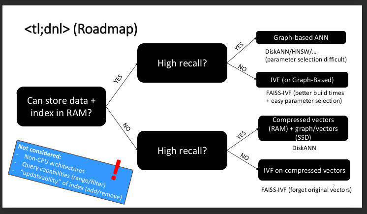
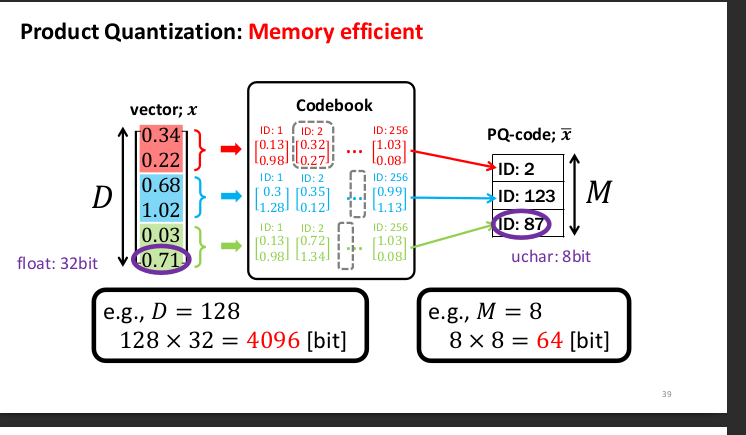

# Matsui 2023 - Survey on Vector Similarity Search Algorithms at billion-scale - Tutorial @ CVPR 2023
- Survey on vector similarity search algorithms like HNSW, NMSLIB, etc.
- Part of a tutorial on neural search at CVPR 2023.
- By Martin Aumüller, University of Copenhagen.
- Full video can be found [here](https://www.youtube.com/watch?v=tvoP1IyZRxE)
- Slides are found [here](matsui23_tutorial_slides-survey.pdf)

## Summary
1. Benchmarking
    - Many algorithms are evaluated on the ANN-Benchmarks and in competitions at NeurIPS.
    - Rules: 2h for index building + single-threaded search.
    - Metrics: QPS over recall
    - See [ann-benchmarks](https://github.com/erikbern/ann-benchmarks) for more info.
2. Algorithms
    - Decision tree for choosing the best algorithm: 
    - 

---

3. In-memory + high recall
    - Best choice: **graph-based algorithms**.
    - Pros: 
        - High recall
        - Scale insanely well; #distance computations almost constant with dataset size.
    - Cons: 
        - Parameter tuning is difficult.
            - Many options and papers are not clear about their settings.
        - High index construction time.
4. In-memory + low recall
    - Best choice: **inverted file-based indexes (IVF)**
    - Idea:
        - Cluster dataset (e.g., with k-means), then search in the cluster.
        - Structure in cluster can be either simple array or another index like HNSW.

5. Disk-based + high recall
    - Best choice: **vector compression through product quantization (PQ) + graph-based algorithms.**
    - Popular choice: DiskANN
    - Index construction:
        1. Cluster the dataset into k (~=40) clusters.
        2. Assign each point to the nearest l (~=2) clusters.
        3. For each cluster, build a Vamana graph (possible to do in-memory bc clusters are arbitrarily small).
        4. Merge the graphs by union of edges and story on disk (SSD). 
            - A block contains:
                - One original vector
                - The indices of its neighbors in the global graph
        5. Store the PQ representation of all dataset vectors in memory.
    - Search:
        - Beam search in the Vamana graphs by following the edges to blocks.
        - Distance computations are done on the PQ representations.
        - Traverse the graph in a batched manner to limit IOs.
        - Post-process the kNN by computing the real distances and reordering accordingly.
6. Disk-based + low recall
    - Best choice: inverted file-based indexes (IVF) + PQ.

--- 
7. Product quantization (PQ)
    - Idea: 
        - Split the vector into subvectors and discretize each subvector by storing the id of the nearest centroid.
        - I.e., k-means is run on each subvector space.
    - 

---

8. Future research
    - **New graph approach by Themis**!
        - [Azizi 2023]
    - Automated parameter tuning.
    - **Filtered search** (i.e., only query the vectors that have certain values in their metadata)
    

